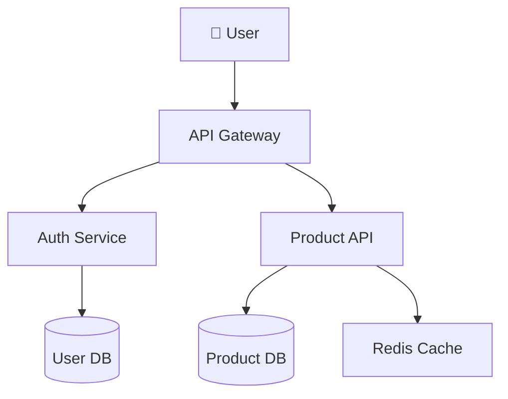
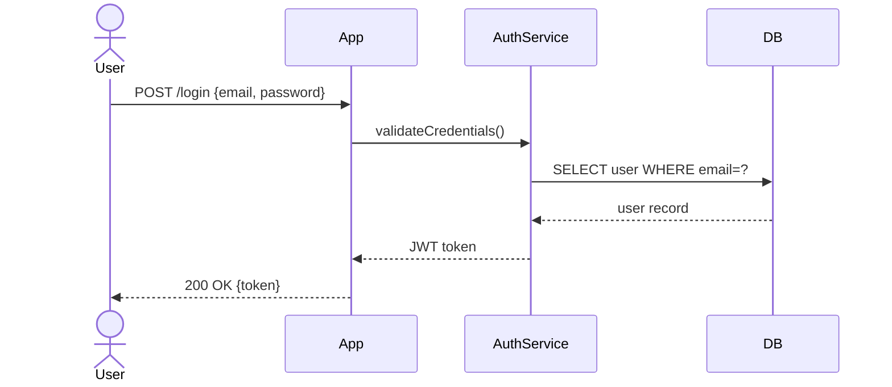
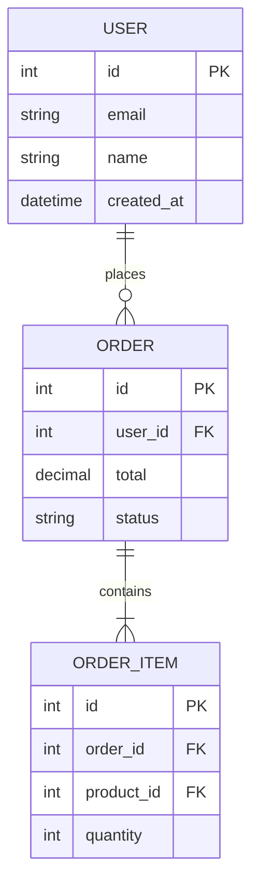

# Mermaid Diagram → Image Generator

Convert Mermaid diagram text to high-quality PNG or SVG images. Works cross-platform using a headless Chromium renderer — no visible browser required.

---

## Quick Start

**User asks:**
```
"Generate a sequence diagram for the login flow and export it as PNG"
"Create a flowchart of the order processing pipeline"
"Draw a class diagram for the user module"
```

**Claude Code will:**
1. Write Mermaid diagram text to a `.mmd` file
2. Run the render CLI to export PNG or SVG
3. Return the image path

---

## Export CLI

### Setup (one-time per machine)
```powershell
cd .claude/skills/mermaid/lib && npm install
```
> First run downloads Chromium (~170 MB). Subsequent runs are fast.

### Usage
```powershell
# SVG output
node .claude/skills/mermaid/lib/render.cjs diagram.mmd diagram.svg

# PNG output
node .claude/skills/mermaid/lib/render.cjs diagram.mmd diagram.png

# With options
node .claude/skills/mermaid/lib/render.cjs diagram.mmd diagram.png --theme dark --scale 2
node .claude/skills/mermaid/lib/render.cjs diagram.mmd diagram.png --background-color transparent
```

### Options

| Option | Values | Default | Description |
|--------|--------|---------|-------------|
| `--theme` | `default`, `dark`, `forest`, `neutral`, `base` | `default` | Color theme |
| `--scale` | number | `1` | PNG pixel density (use `2` for Retina/HiDPI) |
| `--width` | pixels | `800` | Diagram width |
| `--height` | pixels | auto | Diagram height |
| `--background-color` | CSS color or `transparent` | `white` | Background |
| `--config-file` | path to JSON | — | Advanced mermaid config |

---

## Workflow

### Step 1: Identify Diagram Type

Choose the appropriate Mermaid diagram type based on what the user needs:

| Diagram Type | Use For |
|---|---|
| `flowchart TD` / `graph TD` | Process flows, architecture, decision trees |
| `sequenceDiagram` | API calls, user interactions, protocol flows |
| `classDiagram` | OOP class hierarchies, data models |
| `erDiagram` | Database schema, entity relationships |
| `stateDiagram-v2` | State machines, lifecycle flows |
| `gantt` | Project timelines, sprint planning |
| `pie` | Proportional data, breakdowns |
| `gitGraph` | Git branch strategies |
| `mindmap` | Brainstorming, topic hierarchies |
| `timeline` | Historical events, roadmaps |

**Full syntax reference:** See `references/diagram-types.md`

### Step 2: Write Mermaid Text

Write the diagram to a `.mmd` file. Follow the syntax exactly — indentation and newlines matter.

```
flowchart TD
    A[Start] --> B{Decision}
    B -->|Yes| C[Do X]
    B -->|No| D[Do Y]
    C --> E[End]
    D --> E
```

**Syntax cheatsheet:** See `references/syntax-cheatsheet.md`

### Step 3: Choose Output Format

- **SVG**: Best for documentation, scalable, smaller file size
- **PNG**: Best for presentations, chat messages, Markdown embeds

### Step 4: Render

```powershell
node .claude/skills/mermaid/lib/render.cjs path/to/diagram.mmd path/to/output.png
```

### Step 5: Verify

Check that the output file was created and is non-empty. If the render fails, check:
- Is the mermaid syntax valid? (see Common Errors below)
- Was `npm install` run in `lib/`?

---

## Diagram Examples

### Flowchart (Architecture)


### Sequence Diagram (Login Flow)


### ER Diagram (Database Schema)


---

## Common Errors

| Error | Cause | Fix |
|-------|-------|-----|
| `No diagram type detected` | Missing diagram keyword | Start with `flowchart TD`, `sequenceDiagram`, etc. |
| `Parse error` | Syntax mistake | Check indentation and special characters |
| `Render failed` | mmdc not installed | Run `npm install` in `lib/` |
| Empty/blank output | Unsupported syntax | Check mermaid v11 compatibility |
| Node labels with `()` break | Parentheses in labels | Use `["text"]` or escape: `["text (note)"]` |

---

## Output

- **Default location:** Same directory as the `.mmd` file, or user-specified path
- **SVG:** Scalable, small file (~10–30 KB), best for docs
- **PNG:** Rasterized at 1x or 2x scale, best for sharing

---

## Reference Files

| File | Contents |
|------|----------|
| `references/diagram-types.md` | All supported diagram types with complete examples |
| `references/syntax-cheatsheet.md` | Quick syntax reference for shapes, arrows, labels, styles |
| `references/theming.md` | Theme options, custom colors, CSS overrides |
