# Mermaid Diagram Types — Reference

All diagram types supported by Mermaid v11 with complete, copy-ready examples.

---

## flowchart / graph

**Use for:** Process flows, architecture diagrams, decision trees, system overviews.

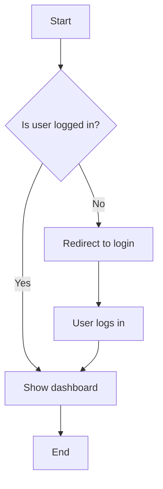

**Direction options:** `TD` (top-down), `LR` (left-right), `BT` (bottom-top), `RL` (right-left)

**Node shapes:**
| Syntax | Shape |
|--------|-------|
| `[text]` | Rectangle |
| `(text)` | Rounded rectangle |
| `([text])` | Stadium / pill |
| `[[text]]` | Subroutine / double rectangle |
| `[(text)]` | Cylindrical (database) |
| `((text))` | Circle |
| `{text}` | Diamond (decision) |
| `{{text}}` | Hexagon |
| `[/text/]` | Parallelogram |
| `[\\text\\]` | Parallelogram (alt) |
| `>text]` | Asymmetric |

**Edge types:**
| Syntax | Meaning |
|--------|---------|
| `-->` | Solid arrow |
| `---` | Solid line (no arrow) |
| `-.->` | Dashed arrow |
| `==>` | Thick arrow |
| `--\|label\|-->` | Arrow with label |
| `-- label -->` | Arrow with label (alt) |

---

## sequenceDiagram

**Use for:** API interactions, user flows, protocol handshakes, microservice communication.

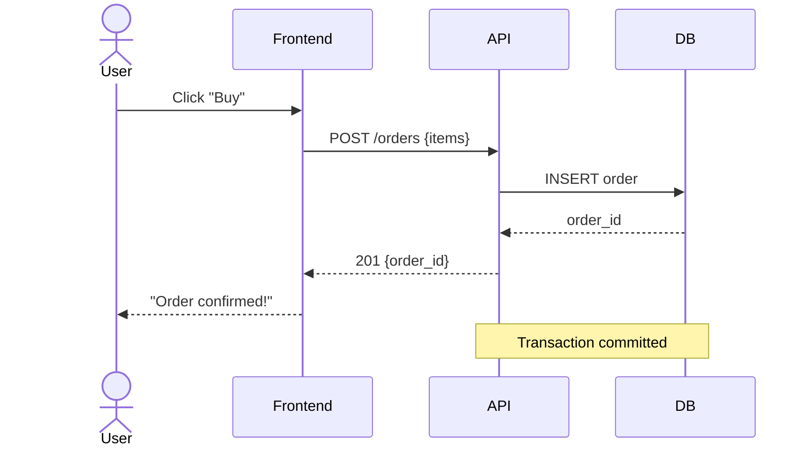

**Message types:**
| Syntax | Type |
|--------|------|
| `A->>B: msg` | Solid arrow |
| `A-->>B: msg` | Dashed arrow (response) |
| `A-)B: msg` | Async arrow |
| `A-xB: msg` | Cross (lost message) |

**Modifiers:** `activate A` / `deactivate A`, `loop`, `alt`/`else`/`end`, `par`, `note over A,B:`

---

## classDiagram

**Use for:** OOP class hierarchies, data models, interface definitions.

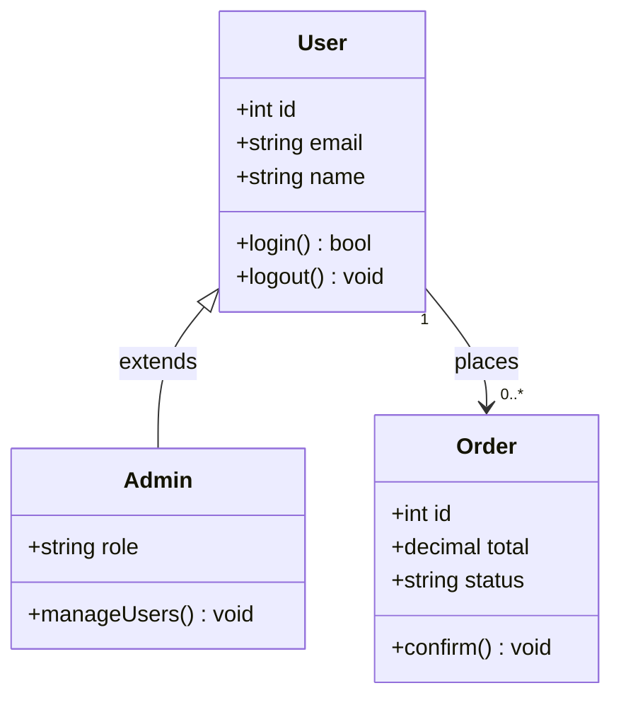

**Visibility:** `+` public, `-` private, `#` protected, `~` package

**Relationships:**
| Syntax | Relationship |
|--------|-------------|
| `<\|--` | Inheritance |
| `*--` | Composition |
| `o--` | Aggregation |
| `-->` | Association |
| `--` | Link |
| `..>` | Dependency |
| `..\|>` | Realization |

---

## erDiagram

**Use for:** Database schema, entity relationships, data modeling.

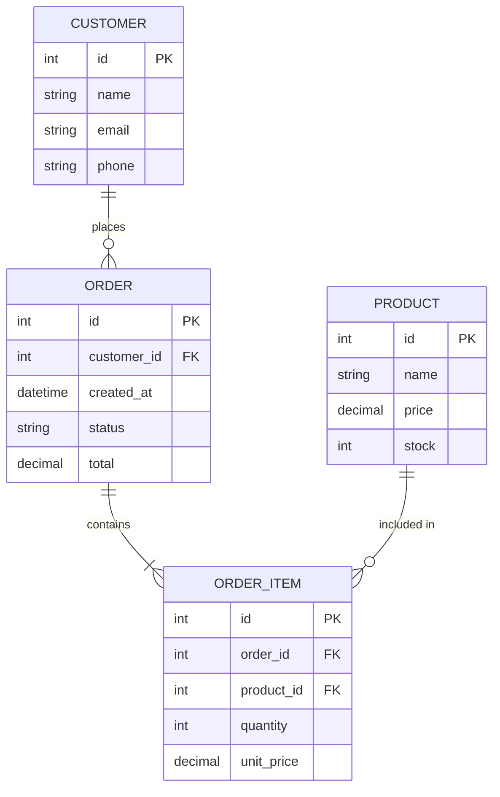

**Cardinality:**
| Syntax | Meaning |
|--------|---------|
| `\|\|` | Exactly one |
| `o\|` | Zero or one |
| `\|\{` | One or more |
| `o\{` | Zero or more |

---

## stateDiagram-v2

**Use for:** State machines, lifecycle diagrams, workflow states.

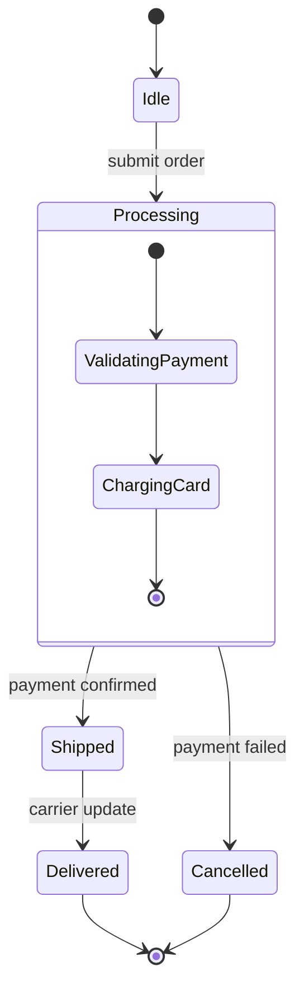

---

## gantt

**Use for:** Project timelines, sprint planning, roadmaps.

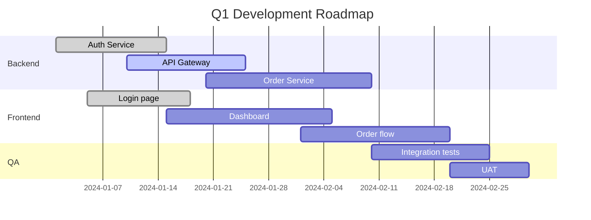

**Task states:** `done`, `active`, `crit` (critical), `milestone`

---

## pie

**Use for:** Proportional data, breakdowns, distributions.

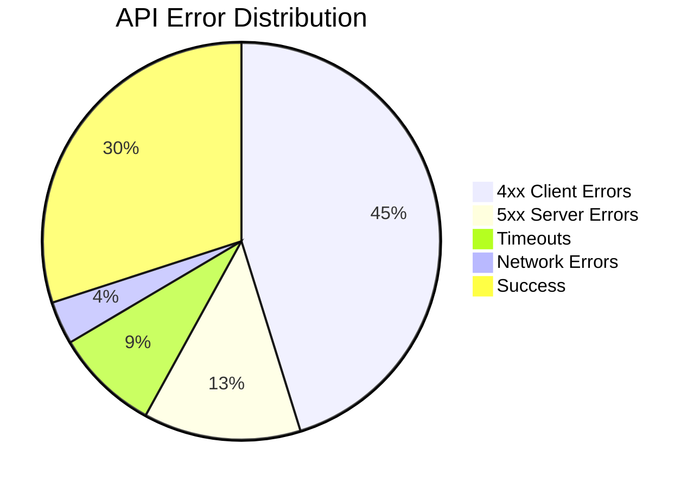

---

## gitGraph

**Use for:** Git branching strategy, release flow, trunk-based development.

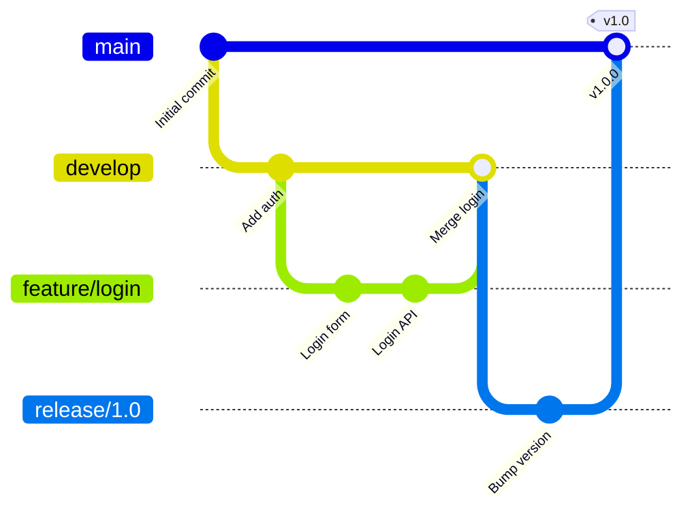

---

## mindmap

**Use for:** Brainstorming, concept hierarchies, topic breakdowns.

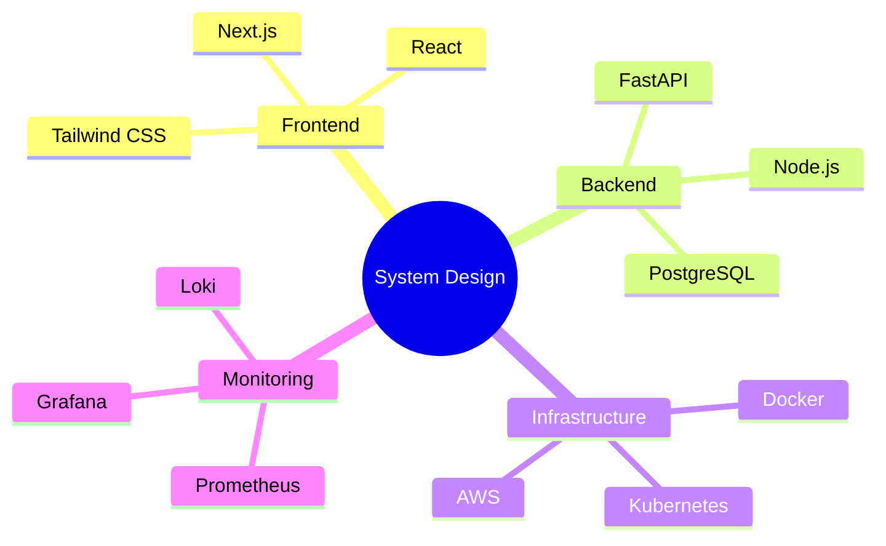

---

## timeline

**Use for:** Historical events, product roadmaps, milestones.

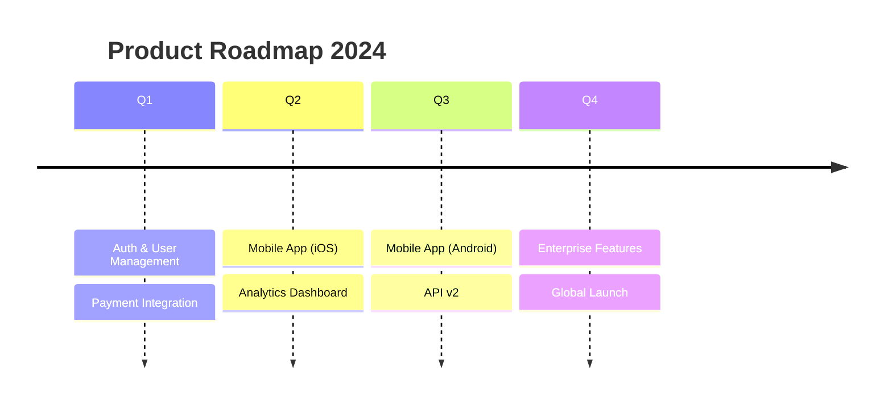

---

## xychart-beta

**Use for:** Bar charts, line charts, data visualization.

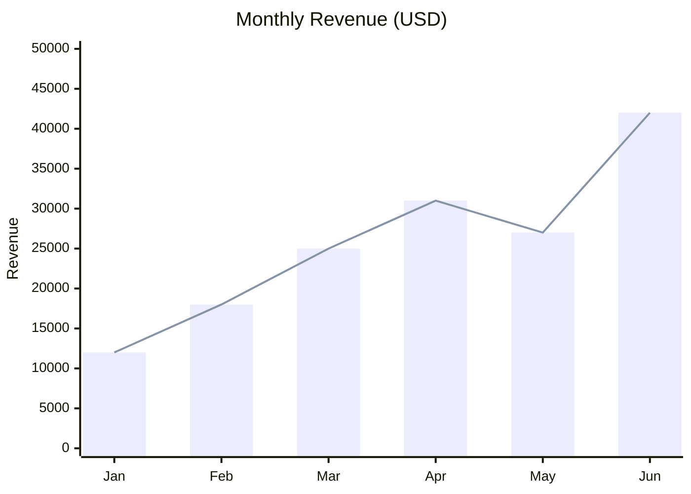
