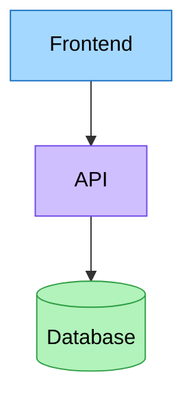
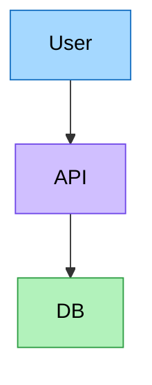
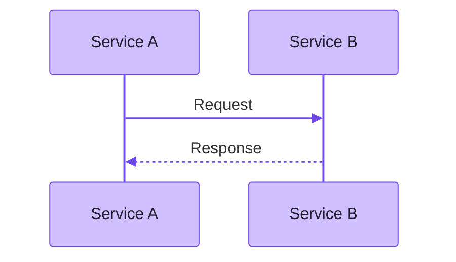
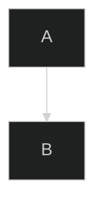

# Mermaid Theming & Styling Guide

---

## Built-in Themes

Pass via `--theme` option to `render.cjs`:

| Theme | Description | Best For |
|-------|-------------|---------|
| `default` | Blue accents, white background | General use, documentation |
| `dark` | Dark background, light text | Dark mode docs, presentations |
| `forest` | Green accents | Nature, sustainability topics |
| `neutral` | Grayscale, minimal | Formal reports, print |
| `base` | Bare minimum, fully customizable | Custom brand colors |

### Example

```powershell
node render.cjs diagram.mmd output.png --theme dark
node render.cjs diagram.mmd output.png --theme forest
```

---

## Background Color

```powershell
# White background (default)
node render.cjs diagram.mmd output.png

# Transparent background (PNG only)
node render.cjs diagram.mmd output.png --background-color transparent

# Custom color
node render.cjs diagram.mmd output.png --background-color "#1a1a2e"
```

---

## Scale / Resolution

```powershell
# 1x (default, ~800px wide)
node render.cjs diagram.mmd output.png

# 2x (Retina/HiDPI quality)
node render.cjs diagram.mmd output.png --scale 2

# 3x (very high resolution for print)
node render.cjs diagram.mmd output.png --scale 3
```

---

## Custom Width

```powershell
# Wide diagram for widescreen
node render.cjs diagram.mmd output.png --width 1920

# Standard presentation width
node render.cjs diagram.mmd output.png --width 1280
```

---

## Advanced: Config File

Create a JSON config file to override theme variables and mermaid settings:

**mermaid-config.json:**
```json
{
  "theme": "base",
  "themeVariables": {
    "primaryColor": "#d0bfff",
    "primaryTextColor": "#1e1e2e",
    "primaryBorderColor": "#7048e8",
    "lineColor": "#7048e8",
    "secondaryColor": "#b2f2bb",
    "tertiaryColor": "#a5d8ff",
    "background": "#ffffff",
    "mainBkg": "#d0bfff",
    "nodeBorder": "#7048e8",
    "clusterBkg": "#f8f9fa",
    "titleColor": "#1e1e2e",
    "edgeLabelBackground": "#ffffff",
    "fontFamily": "arial, sans-serif",
    "fontSize": "16px"
  },
  "flowchart": {
    "curve": "basis",
    "padding": 20
  },
  "sequence": {
    "mirrorActors": false,
    "bottomMarginAdj": 10,
    "useMaxWidth": false
  }
}
```

```powershell
node render.cjs diagram.mmd output.png --config-file mermaid-config.json
```

---

## Per-Node Styling in Flowcharts

Override individual node colors directly in the diagram:



### classDef for reusable styles



---

## Recommended Color Palette

Matches the Excalidraw skill palette for visual consistency:

| Component Type | Fill | Stroke |
|---------------|------|--------|
| Frontend / UI | `#a5d8ff` | `#1971c2` |
| Backend / API | `#d0bfff` | `#7048e8` |
| Database | `#b2f2bb` | `#2f9e44` |
| Storage / Files | `#ffec99` | `#f08c00` |
| AI / ML | `#e599f7` | `#9c36b5` |
| External APIs | `#ffc9c9` | `#e03131` |
| Orchestration | `#ffa8a8` | `#c92a2a` |
| Message Queue | `#fff3bf` | `#fab005` |
| Cache | `#ffe8cc` | `#fd7e14` |
| Users | `#e7f5ff` | `#1971c2` |

---

## Sequence Diagram Styling



---

## Init Directive (Inline Config)

Embed config directly in the `.mmd` file:


